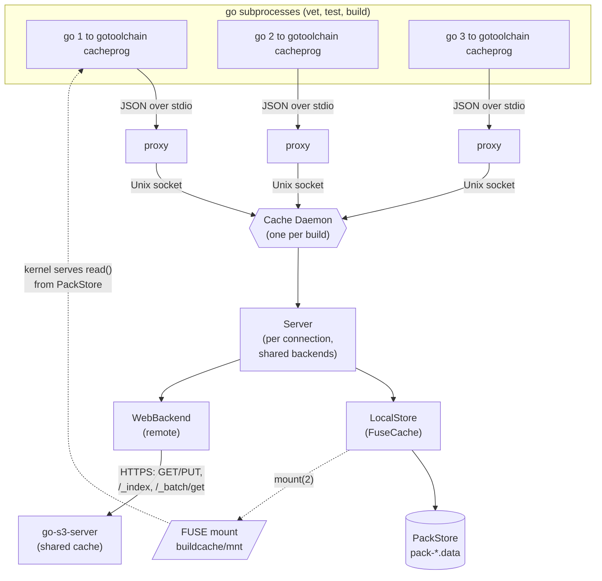
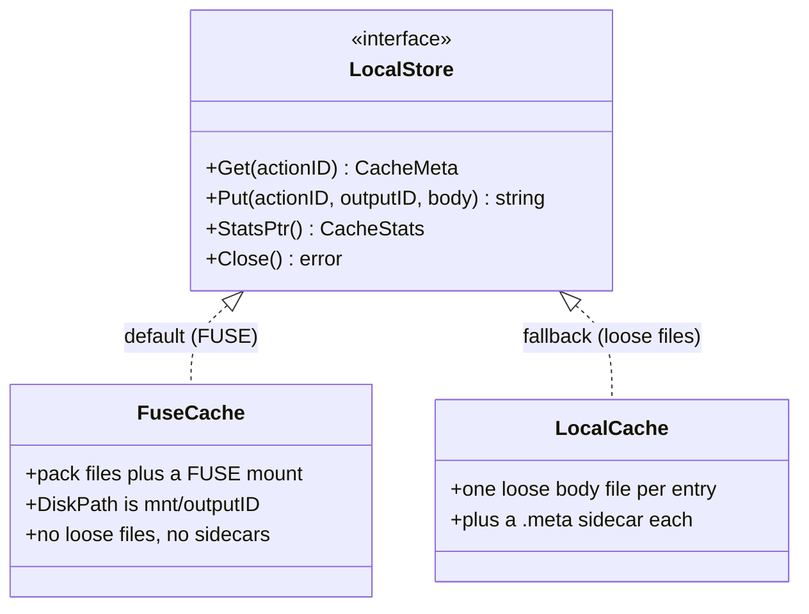
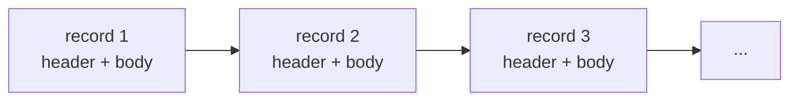
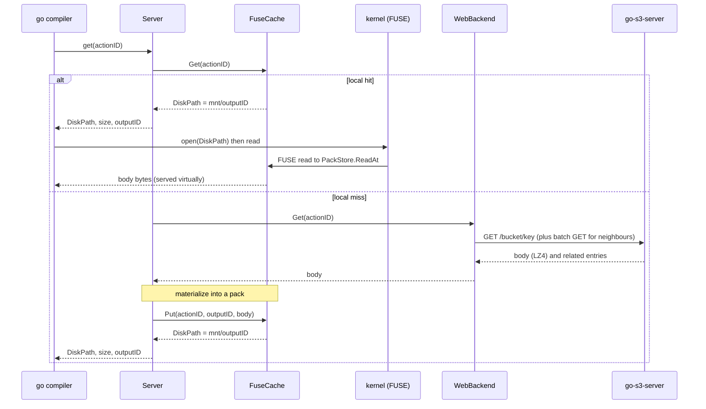
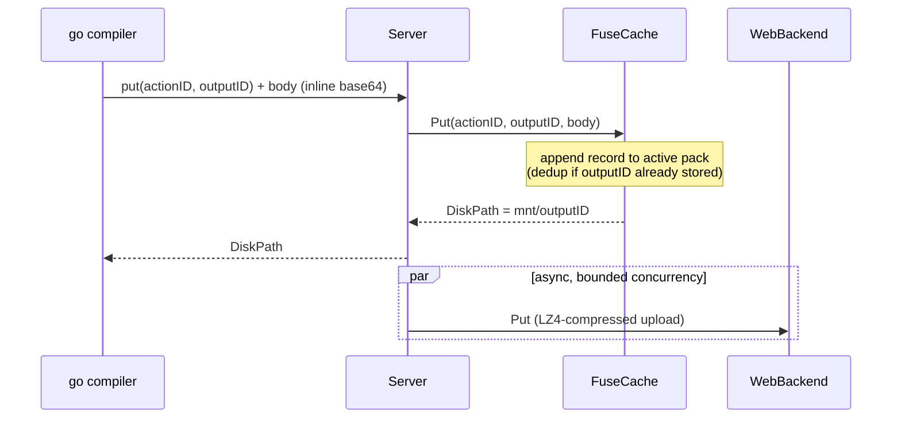
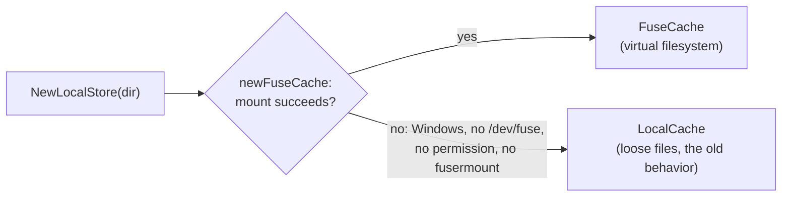

# The go-toolchain build cache

This document explains how go-toolchain caches Go build artifacts: the
GOCACHEPROG protocol, the two-tier (local + web) design, and — the interesting
part — how the local tier is a **FUSE virtual filesystem** that collapses the
build cache's notorious tiny-file explosion into a handful of pack files.

- [The problem: a build cache is mostly tiny files](#the-problem)
- [GOCACHEPROG in one paragraph](#gocacheprog)
- [The key insight: GET returns a *path*, not bytes](#the-key-insight)
- [Architecture](#architecture)
- [The local tier is a virtual filesystem](#the-local-tier-is-a-virtual-filesystem)
- [Pack file format](#pack-file-format)
- [Request flows (GET / PUT)](#request-flows)
- [Fallback and portability](#fallback-and-portability)
- [Where the bytes live](#where-the-bytes-live)

<a name="the-problem"></a>
## The problem: a build cache is mostly tiny files

Go's own build cache (`$GOCACHE`) stores **two files per cache entry**: an
action-index file (always the same fixed size, ~175 bytes) and an output/data
file (the actual artifact). On a real workspace the index files alone number in
the hundreds of thousands, and a large fraction of the *data* files — source
file lists, vet facts, export-data stubs — are well under 1 KiB.

Tiny files are expensive out of proportion to their bytes: each one burns an
inode, a directory entry, and (rounding up to the filesystem block size, usually
4 KiB) most of a block. A cache holding 170 KB of index data can occupy ~4 MB on
disk — a >20x amplification — before you count the data files.

go-toolchain replaces `$GOCACHE` entirely with a GOCACHEPROG server, so it owns
the storage policy and can fix this.

<a name="gocacheprog"></a>
## GOCACHEPROG in one paragraph

`GOCACHEPROG` is a Go toolchain hook (Go 1.24+): point it at a program and the
`go` command talks to that program over stdin/stdout with newline-delimited JSON
instead of managing `$GOCACHE` itself. The verbs are `get`, `put`, `close`. A
`put` ships the body inline (base64 on the line after the JSON). A `get` hit is
answered with metadata **and a `DiskPath`** — see below. go-toolchain implements
this protocol in [`src/cache`](../src/cache); `src/cmd/cacheprog.go` is the
entry point.

<a name="the-key-insight"></a>
## The key insight: GET returns a *path*, not bytes

The protocol is asymmetric, and the asymmetry is the whole design:

| Verb | How the body moves |
|------|--------------------|
| **PUT** | body travels **inline** over the protocol (base64 after the JSON request) |
| **GET** | response carries a **`DiskPath`**; the compiler/linker open and mmap that path **themselves** — the bytes never travel back over the protocol |

So a cache hit hands the compiler a *filesystem path*. And nothing requires that
path to be a normal file. If we back it with a **FUSE mount**, the cache program
*is* a virtual filesystem and the JSON protocol is just the coordination
channel. The body can live packed; the kernel materializes it virtually when the
compiler reads the path. That is exactly what the local tier does.

<a name="architecture"></a>
## Architecture

One `go-toolchain` invocation starts **one cache daemon**. Every `go`
subprocess it spawns (`go vet`, `go test`, `go build`, ...) is pointed at a thin
`cacheprog` that just proxies to the daemon over a Unix socket, so the web index
is loaded once and the local cache is shared.



The two tiers:

- **Local tier — `FuseCache`** (`src/cache/fusecache.go`, `src/cache/pack.go`):
  process-local, backed by pack files and exposed via FUSE. First port of call
  for every `get`; every `put` is written here synchronously.
- **Remote tier — `WebBackend`** (`src/cache/web.go`): the shared
  [go-s3-server](https://github.com/wow-look-at-my/go-s3-server). Consulted on a
  local miss; populated asynchronously on `put`. A miss also triggers a
  **batch GET** that returns temporally-related entries (same build) and
  pre-populates the local pack — see [`src/cache/batch.go`](../src/cache/batch.go).

<a name="the-local-tier-is-a-virtual-filesystem"></a>
## The local tier is a virtual filesystem

The local tier is defined by the [`LocalStore`](../src/cache/store.go)
interface, with two implementations: `FuseCache` (default) and `LocalCache`
(the loose-file fallback).



`FuseCache` is the default (when FUSE is available). It wraps a **`PackStore`**
— an append-only, content-addressed object store — and mounts a **read-only
FUSE filesystem** at `<cache>/buildcache/mnt`:

- **`Get(actionID)`** looks up the body's location in the in-memory index and
  returns `DiskPath = <mnt>/<outputID>`. No I/O on the body.
- The compiler opens that path. The kernel routes the `open`/`read` to the
  daemon's FUSE handler, which serves the bytes straight from the pack with a
  single `ReadAt` — supporting partial/random reads (mmap) with no copy of the
  whole body.
- **`Put`** appends the body to the active pack and returns the same
  `<mnt>/<outputID>` path.

The result: **no loose file and no metadata sidecar is ever written per entry.**
A build that would have produced ~1,000 tiny files produces **one pack file**.

> Measured on a real `go-s3-server` build: the entire local build cache was a
> single 73 MB `pack-000001.data` holding ~500 objects — `0` `.meta` sidecars
> and `0` loose body files — while the build hit the cache `~7000` times, all
> served through the mount.

<a name="pack-file-format"></a>
## Pack file format

A pack file is a flat sequence of self-describing records. The in-memory index
(`actionID → location` and `outputID → location`) is rebuilt purely by scanning
the packs at startup — there is no separate index file to corrupt or keep in
sync.

Each record is a fixed 88-byte header followed by the body:

| Field | Size | Meaning |
|-------|------|---------|
| `magic` | 4 B | `"GTPR"`; anything else ends the scan (garbage / torn write) |
| `actionID` | 32 B | cache key (SHA-256) |
| `outputID` | 32 B | content hash (SHA-256) — also the virtual filename |
| `created` | 8 B | unix seconds |
| `dataLen` | 8 B | body length |
| `crc32` | 4 B | IEEE CRC of the body (offline integrity checks) |
| `body` | `dataLen` B | the cached object, stored uncompressed |

Records are simply concatenated:



Design properties:

- **Self-describing & crash-safe.** Startup reads only the fixed 88-byte headers
  (never the bodies), so the scan is cheap even for multi-GB packs. A torn final
  record (crash mid-append) declares a length running past EOF and is silently
  dropped — the store is crash-safe by construction.
- **Content-addressed dedup.** `outputID` is the SHA-256 of the body, so
  identical content put under different actions is stored once. The second and
  later actions append a tiny header-only **alias record** (a second magic,
  `dataLen 0`) that maps their `actionID` onto the already-stored `outputID`.
  The alias is written to disk on purpose: a build is full of duplicate content
  (every empty output — vet success, empty stdout — shares `sha256("")`), and if
  the dedup lived only in memory those thousands of mappings would vanish on
  restart and miss on the next build, falling through to the slow network tier.
- **Bounded growth.** Packs rotate at 1 GiB (`pack-000001.data`,
  `pack-000002.data`, ...). If the total exceeds a cap at startup, the store
  resets to a cold cache rather than growing forever — the same "purge instead of
  trust stale data" stance the server takes on a cache-version bump.

<a name="request-flows"></a>
## Request flows

### GET



### PUT



Note the bodies are stored **uncompressed** in the pack (the web tier compresses
for transport only). Uncompressed storage is what lets FUSE serve a `read()` at
an arbitrary offset with a single `ReadAt` — essential for the compiler's mmap'd
random access, which a compressed stream could not satisfy without decompressing
the whole object on every read.

<a name="fallback-and-portability"></a>
## Fallback and portability

The cache is an optimization, never a correctness dependency, so FUSE failure
degrades gracefully:



- **Mounting** uses go-fuse's `DirectMount`: the `mount(2)` syscall (works as
  **root**, e.g. in containers) with an automatic fallback to the `fusermount`
  helper (works for **non-root CI runners**). One setting covers both.
- **Windows / no FUSE**: `newFuseCache` returns `errFuseUnsupported` and
  `NewLocalStore` falls back to the loose-file `LocalCache`.
- **Single owner**: only the daemon (one process per build) owns the mount, so
  concurrent standalone `cacheprog` invocations can't collide on one mount
  point; standalone mode uses the loose cache.
- **Crash recovery**: a stale mount left by a crashed daemon is lazily unmounted
  before a fresh mount; the pack store is rebuilt by scanning.

<a name="where-the-bytes-live"></a>
## Where the bytes live

```
<XDG_CACHE_HOME>/go-toolchain/buildcache/
├── mnt/                     # FUSE mount point (empty when unmounted)
│   └── <outputID>           # virtual files; reads served from packs
└── packs/
    ├── pack-000001.data     # append-only records (see format above)
    └── pack-000002.data     # ... after rotation at 1 GiB
```

Compare the loose-file fallback, which writes `buildcache/<aa>/v1<actionID>` plus
a `.meta` sidecar **per entry** across 256 shard directories — the layout this
design replaces.
