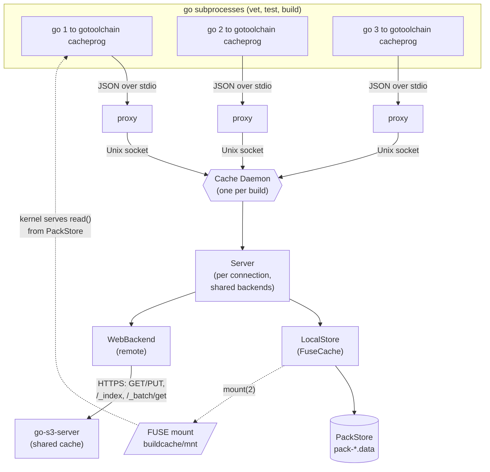
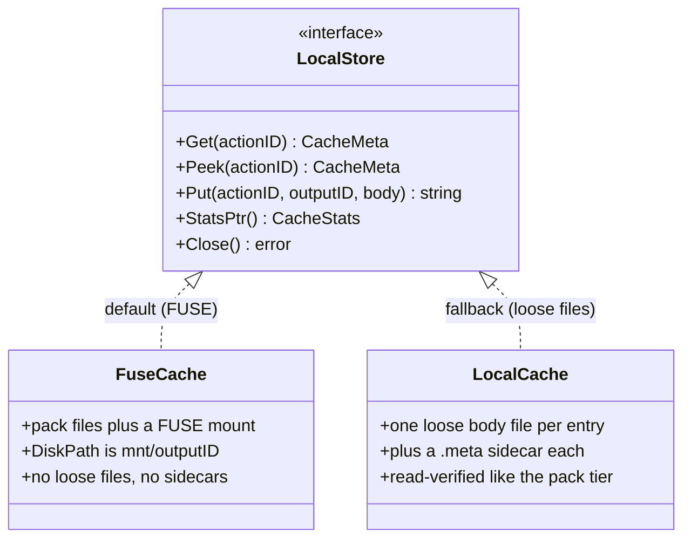
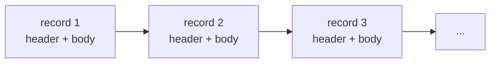
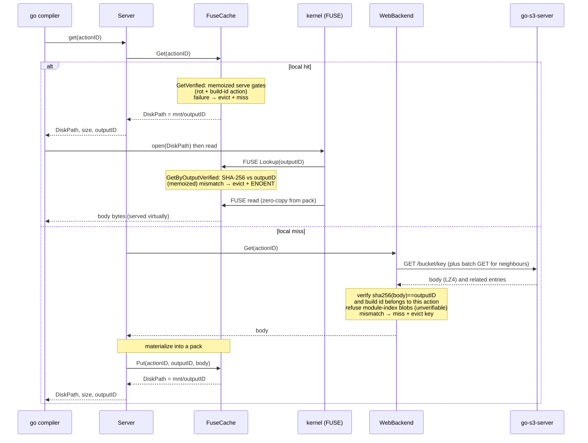
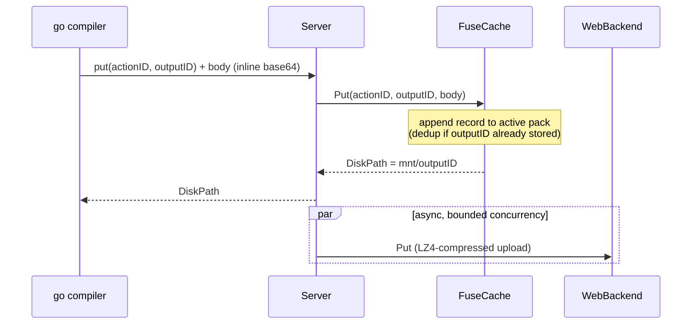
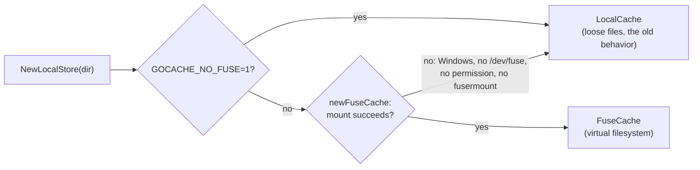

# The go-toolchain build cache

This document explains how go-toolchain caches Go build artifacts: the
GOCACHEPROG protocol, the two-tier (local + web) design, and — the interesting
part — how the local tier is a **FUSE virtual filesystem** that collapses the
build cache's notorious tiny-file explosion into a handful of pack files.

- [The problem: a build cache is mostly tiny files](#the-problem)
- [GOCACHEPROG in one paragraph](#gocacheprog)
- [The key insight: GET returns a *path*, not bytes](#the-key-insight)
- [Architecture](#architecture)
- [The local tier is a virtual filesystem](#the-local-tier-is-a-virtual-filesystem)
- [Pack file format](#pack-file-format)
- [Request flows (GET / PUT)](#request-flows)
- [Fallback and portability](#fallback-and-portability)
- [Where the bytes live](#where-the-bytes-live)

<a name="the-problem"></a>
## The problem: a build cache is mostly tiny files

Go's own build cache (`$GOCACHE`) stores **two files per cache entry**: an
action-index file (always the same fixed size, ~175 bytes) and an output/data
file (the actual artifact). On a real workspace the index files alone number in
the hundreds of thousands, and a large fraction of the *data* files — source
file lists, vet facts, export-data stubs — are well under 1 KiB.

Tiny files are expensive out of proportion to their bytes: each one burns an
inode, a directory entry, and (rounding up to the filesystem block size, usually
4 KiB) most of a block. A cache holding 170 KB of index data can occupy ~4 MB on
disk — a >20x amplification — before you count the data files.

go-toolchain replaces `$GOCACHE` entirely with a GOCACHEPROG server, so it owns
the storage policy and can fix this.

<a name="gocacheprog"></a>
## GOCACHEPROG in one paragraph

`GOCACHEPROG` is a Go toolchain hook (Go 1.24+): point it at a program and the
`go` command talks to that program over stdin/stdout with newline-delimited JSON
instead of managing `$GOCACHE` itself. The verbs are `get`, `put`, `close`. A
`put` ships the body inline (base64 on the line after the JSON). A `get` hit is
answered with metadata **and a `DiskPath`** — see below. go-toolchain implements
this protocol in [`src/cache`](../src/cache); `src/cmd/cacheprog.go` is the
entry point.

<a name="the-key-insight"></a>
## The key insight: GET returns a *path*, not bytes

The protocol is asymmetric, and the asymmetry is the whole design:

| Verb | How the body moves |
|------|--------------------|
| **PUT** | body travels **inline** over the protocol (base64 after the JSON request) |
| **GET** | response carries a **`DiskPath`**; the compiler/linker open and mmap that path **themselves** — the bytes never travel back over the protocol |

So a cache hit hands the compiler a *filesystem path*. And nothing requires that
path to be a normal file. If we back it with a **FUSE mount**, the cache program
*is* a virtual filesystem and the JSON protocol is just the coordination
channel. The body can live packed; the kernel materializes it virtually when the
compiler reads the path. That is exactly what the local tier does.

<a name="architecture"></a>
## Architecture

One `go-toolchain` invocation starts **one cache daemon**. Every `go`
subprocess it spawns (`go vet`, `go test`, `go build`, ...) is pointed at a thin
`cacheprog` that just proxies to the daemon over a Unix socket, so the web index
is loaded once and the local cache is shared.



The two tiers:

- **Local tier — `FuseCache`** (`src/cache/fusecache.go`, `src/cache/pack.go`):
  process-local, backed by pack files and exposed via FUSE. First port of call
  for every `get`; every `put` is written here synchronously.
- **Remote tier — `WebBackend`** (`src/cache/web.go`): the shared
  [go-s3-server](https://github.com/wow-look-at-my/go-s3-server) (being renamed
  go-toolchain-cache). Consulted on a local miss; populated asynchronously on
  `put`. Fetch routing is driven by the server's key index, fetched once at
  startup (with a short dedicated budget): keys the index lists are fetched
  through the coalescing **batch GET** endpoint — one round-trip serves many
  concurrent requests and returns temporally-related prefetch entries (same
  build) that pre-populate the local pack — see
  [`src/cache/batch.go`](../src/cache/batch.go); keys an AUTHORITATIVE (fresh)
  index does not list miss cleanly with no round-trip, while a failed index
  fetch keeps cold-key batch probing enabled as the recovery path (bounded by
  the consecutive-empty-batch backoff). A key the server authoritatively
  reports absent despite an index claim is dropped from the client's key set
  so the next `put` re-uploads it. Uploads are coalesced symmetrically:
  buffered PUTs ship as one **batch PUT** tar (`/_batch/put`,
  `manifest.json` + `data/<key>` members — see
  [`src/cache/batchput.go`](../src/cache/batchput.go)) so a build's thousands
  of stores take one server admission slot per ~128 objects, with a sticky
  fallback to individual PUTs against a server without the endpoint. The wire
  protocol is **not
  S3**: object metadata travels in native `X-Cache-Meta-*` headers and errors
  are native plain text. The client still reads the deprecated `X-Amz-Meta-*`
  response header as a fallback so it interoperates with a not-yet-upgraded
  server during a rollout. Every PUT (batch manifest entry or single-PUT
  headers — both render the same map, assembled once in
  [`src/cache/webput.go`](../src/cache/webput.go)) carries **provenance
  metadata** alongside the protocol fields: `Pkg` (the archive's import
  path), `Src` (source-file basenames, capped at 8 names / 256 bytes with a
  `+N more` suffix so the value always fits the server's xattr budget),
  `Module` (the producing repo's main module path), `Go-Version`/`Target`,
  `Toolchain-Version`, and `Created`. The server stores them as xattrs and
  returns them on GET/HEAD, so `curl -I` on any stored key answers "what
  file/package/repo did this cache item come from?" — the full key list and
  an example live in the README's "How It Works" section.

<a name="the-local-tier-is-a-virtual-filesystem"></a>
## The local tier is a virtual filesystem

The local tier is defined by the [`LocalStore`](../src/cache/store.go)
interface, with two implementations: `FuseCache` (default) and `LocalCache`
(the loose-file fallback).



`FuseCache` is the default (when FUSE is available). It wraps a **`PackStore`**
— an append-only, content-addressed object store — and mounts a **read-only
FUSE filesystem** at `<cache>/buildcache/mnt`:

- **`Get(actionID)`** looks up the body's location in the in-memory index and
  returns `DiskPath = <mnt>/<outputID>`. No I/O on the body.
- The compiler opens that path. The kernel routes the `open`/`read` to the
  daemon's FUSE handler, which serves the bytes straight from the pack with a
  single `ReadAt` — supporting partial/random reads (mmap) with no copy of the
  whole body.
- **`Put`** appends the body to the active pack and returns the same
  `<mnt>/<outputID>` path.

The result: **no loose file and no metadata sidecar is ever written per entry.**
A build that would have produced ~1,000 tiny files produces **one pack file**.

> Measured on a real `go-s3-server` build: the entire local build cache was a
> single 73 MB `pack-000001.data` holding ~500 objects — `0` `.meta` sidecars
> and `0` loose body files — while the build hit the cache `~7000` times, all
> served through the mount.

<a name="pack-file-format"></a>
## Pack file format

A pack file is a flat sequence of self-describing records. The in-memory index
(`actionID → location` and `outputID → location`) is rebuilt purely by scanning
the packs at startup — there is no separate index file to corrupt or keep in
sync.

Each record is a fixed 88-byte header followed by the body:

| Field | Size | Meaning |
|-------|------|---------|
| `magic` | 4 B | `"GTPR"`; anything else ends the scan (garbage / torn write) |
| `actionID` | 32 B | cache key (SHA-256) |
| `outputID` | 32 B | content hash (SHA-256) — also the virtual filename |
| `created` | 8 B | unix seconds |
| `dataLen` | 8 B | body length |
| `crc32` | 4 B | IEEE CRC of the body, verified before the body is served |
| `body` | `dataLen` B | the cached object, stored uncompressed |

Records are simply concatenated:



Design properties:

- **Self-describing & crash-safe.** Startup reads only the fixed 88-byte headers
  (never the bodies), so the scan is cheap even for multi-GB packs. A torn final
  record (crash mid-append) declares a length running past EOF and is silently
  dropped — the store is crash-safe by construction.
- **Integrity-checked on read.** A torn-tail check cannot catch a body that is
  full-length but corrupt in content (overlay/disk bit-rot, a partial
  overwrite). So the body's CRC is verified against the header before it is
  served; a mismatch evicts the entry and reports a **miss**, so the toolchain
  recomputes rather than being handed a corrupt object. Serving corrupt bytes is
  never an option — e.g. a corrupt Go module index fails the build with `corrupt
  index` / `package ... is not in std`, which the `go` process cannot recover
  from. Crucially the check runs on **both** read paths, because they are
  decoupled by the protocol: a GET *RPC* returns a `DiskPath`, and the compiler
  then opens that path and reads the body itself through the mount — a read that
  never re-enters the GET RPC. So the body is verified (1) on the GET RPC, by
  `GetVerified` — a CRC over the body, which lets the server miss and recompute
  in-band; **and** (2) on the mount's serve path, by `GetByOutputVerified` when
  `Lookup` resolves `mnt/outputID` to an inode, which is the gate on the bytes the
  compiler actually consumes. The serve-path gate verifies the body's **SHA-256
  against the requested `outputID`** (the content address) rather than the CRC:
  this strictly subsumes the CRC — it catches rot *and* a torn or mis-mapped
  record whose bytes are self-consistent with their own recorded CRC yet are not
  the content the compiler asked for (which would otherwise surface as `corrupt
  index` / `package ... is not in std`, e.g. a poisoned module index when the
  shared web cache is unavailable). Verifying only the RPC would leave the
  compiler-facing read unguarded. Large bodies are verified over
  an **mmap** of the pack region (via
  [go-mmap](https://github.com/wow-look-at-my/go-mmap)) so a multi-MB archive is
  never copied onto the heap on every hit; tiny entries (the common case) take a
  plain read. The CRC is recorded at write time, so it vouches only for bytes
  that were correct when stored; a body that arrives *already* corrupt from the
  remote tier is caught earlier, at ingestion — see below.
- **Content-addressed dedup.** `outputID` is the SHA-256 of the body, so
  identical content put under different actions is stored once. The second and
  later actions append a tiny header-only **alias record** (a second magic,
  `dataLen 0`) that maps their `actionID` onto the already-stored `outputID`.
  The alias is written to disk on purpose: a build is full of duplicate content
  (every empty output — vet success, empty stdout — shares `sha256("")`), and if
  the dedup lived only in memory those thousands of mappings would vanish on
  restart and miss on the next build, falling through to the slow network tier.
- **Bounded growth.** Packs rotate at 1 GiB (`pack-000001.data`,
  `pack-000002.data`, ...). If the total exceeds the budget at startup, whole
  packs are evicted **oldest-first** down to ~80% of the budget
  (`src/cache/packevict.go`); the newest pack — the append target holding the
  hottest records — is never evicted. Evicted records are simply recomputed;
  the hot tail of the cache survives instead of cold-cycling.
- **Verified-read memoization.** The serve gates below consume per-record
  facts (CRC-ok, SHA-256 vs `outputID`, package shape, build-id stamp)
  computed by ONE body read and memoized by
  `(packID, dataOff)` (`src/cache/verify.go`) — sound because records are
  append-only and physically immutable within a process. Just-appended records
  are pre-memoized from the in-memory bytes, so the compiler's open right
  after a PUT costs no re-read + hash. Facts are memoized, verdicts are
  per-call: the per-action build-id gate is still applied on every `get`.

<a name="request-flows"></a>
## Request flows

### GET



**Integrity at the network boundary.** The remote tier is shared (one S3 cache
serves every machine), so a single corrupt object — a truncated upload, a bad
LZ4 round-trip, or bit-rot at rest — would otherwise poison every consumer and
stick across runs: stored into a pack with a self-consistent CRC, it would pass
`GetVerified` on every later hit and be served as "valid" forever, surfacing in
the `go` command as an unrecoverable `corrupt index`. The pack CRC cannot stop
this because it is computed *from the bytes handed to `Put`* — including ones
that were already corrupt on arrival. So every body ingested from the web tier
is verified **end to end** before it is materialized: it must hash (SHA-256) to
its advertised `outputID`, which is exactly the content hash the `go` command
computed (and which the pack store's content-addressed dedup already trusts). A
mismatch is refused — treated as a miss, never stored or served — and the
poisoned key is dropped from the in-memory remote index, so the toolchain
recomputes the object and the next `Put` re-uploads it clean instead of skipping
as already-present. This covers all three ingestion paths: the individual GET,
the batch GET, and the prefetch population of neighbours. The check is counted
as `checksum` in the daemon's `web summary` miss breakdown.

**Integrity vs. the right key, not just the right bytes.** The outputID hash
proves a body is internally consistent with its content id — but *not* that the
content belongs under the **action** the cacheprog was asked for. A
self-consistent object mapped to the wrong action key passes every hash check
and still poisons the build: the canonical case is `internal/reflectlite` export
data served for the `runtime` action, which the Go loader reports as the
baffling `"runtime" imported as reflectlite`. Neither the CRC nor the outputID
hash can catch this — the bytes are a perfectly valid object, just the wrong
one. A compiled package, though, self-certifies which action produced it: the Go
toolchain stamps `build id "ACTION/CONTENT"` into the archive's `__.PKGDEF`
header, where `ACTION` is `base64.RawURLEncoding(actionID[:15])` — the very hash
that is the cache key. So `buildIDMatchesAction`
([`src/cache/buildid.go`](../src/cache/buildid.go)) parses that field and rejects
any object whose build id belongs to a different action than requested, treating
it as a miss and evicting the key so a recompute re-uploads the correct object.
The guard runs on every remote ingestion path (individual GET, batch GET,
prefetch population) **and** on the remote PUT, so a mis-keyed object can neither
be served from the shared cache nor written to it. It is counted as `buildid` in
the `web summary` miss breakdown.

The check also refuses a **package archive that carries no build id at all**:
`go build`/`vet`/`test` always stamp one, so an object that presents as a
loadable package (an ar archive with a `__.PKGDEF` member) yet lacks a build id
is corrupt — or has been deliberately *stripped* to slip a different package's
export data under this key while evading the comparison above. Plain non-archive
entries (vet facts, command stdout, source-file lists, empty outputs) have no
`__.PKGDEF` and legitimately carry no build id, so they fall through to the
outputID hash as before; only objects shaped like a package are required to
prove their key. This is best-effort *integrity*, not an *authorization*
boundary: a writer who forges a build id matching the target action still
passes, because the cache trusts whoever can write to it. A shared cache must
therefore also control who may `PUT` (and treat the store as untrusted-write) —
the build-id guard stops accidental cross-contamination and unsophisticated
tampering, not a credentialed attacker. The poisoned key self-heals: under the cache
server's default `write_once: allow`, the recompute's re-`Put` overwrites the
bad object; an operator can also evict it directly via the cache server's
`DELETE` endpoint.

**The one payload that cannot be key-verified: the Go module index.** `cmd/go`
stores its package/directory index *through* the build cache too —
`cache.Default()` is the GOCACHEPROG when one is set, so the index's
`PutBytes`/`GetMmap` flow over this protocol just like compiled objects. But an
index blob is the worst of both worlds for the guards above: it carries **no
build id** (so `buildIDMatchesAction` waves it through, exactly like vet facts),
and it does **not** embed the directory it indexes in any form checkable against
the requested `dirHash` action key — yet a wrong one is *silently fatal at
package load*. An index for a directory with no Go files served for
`$GOROOT/src/runtime` makes the loader report `package runtime is not in std`
and fail before compilation starts; a truncated or cross-version one yields
`corrupt index`. The outputID hash only proves the blob is self-consistent, not
that it belongs under this key, so a mis-keyed-but-well-formed index slips every
check. Because an index is cheap for `cmd/go` to recompute locally (one
directory read), the safe answer is to never trust one from the **shared**
tier: `isGoModuleIndex` ([`src/cache/modindex.go`](../src/cache/modindex.go))
detects the `go index v` magic, and the cacheprog **refuses every module-index
blob on ingestion** (individual GET, batch GET, prefetch population) — treating
it as a miss so the index is rebuilt locally — **and refuses to upload one** on
PUT, so the shared cache stops accumulating an unverifiable, build-breaking
payload. Refused GETs are counted as `modindex` in the `web summary` miss
breakdown. A false positive (some other payload starting with the same magic)
costs only a recompute, never correctness, so the prefix match is deliberately
conservative. This is a *client-side* defense: the cache server stores opaque
bytes and cannot itself tell a good index from a poisoned one, so enforcement
lives where the semantics are known — in the cacheprog.

The refusal is deliberately scoped to the shared tier. The **local** tiers
store and serve their *own* module indexes like any other object — the exact
trust upstream `GOCACHE` places in its own directory — still SHA-256-verified
against `outputID` (rot-protected), because after the ingestion + upload
refusals above, an index in the local store can only have been computed by the
local `cmd/go` under its own action key. Refusing it locally (an earlier
iteration did) created a permanent accept-at-Put/refuse-at-Get loop: `cmd/go`
stores hundreds of per-directory index blobs per invocation, so every index key
missed on every build forever — per-key eviction log spam on the loose tier,
duplicate-record append churn and unbounded pack growth on the pack tier. The
one gap — local stores populated by binaries *older* than the web-ingestion
guards, which may hold web-originated (potentially mis-keyed) indexes — is
closed by the one-time local cache version purge (see below).

### PUT



Note the bodies are stored **uncompressed** in the pack (the web tier compresses
for transport only). Uncompressed storage is what lets FUSE serve a `read()` at
an arbitrary offset with a single `ReadAt` — essential for the compiler's mmap'd
random access, which a compressed stream could not satisfy without decompressing
the whole object on every read.

Two ordering guarantees protect the PUT path against racing writers for the
same action key:

- **Append order == index order.** `PackStore.Put` commits its in-memory index
  update *under the append lock*, so the record order in the pack file always
  matches the order the live index applied. Before this, two racing Puts for
  the same action with different contents could commit their map updates in
  the opposite order of their file appends — the live daemon served one body
  while the **next** process's startup scan ("last write wins" over file
  order) served the other, a silent cross-build divergence that surfaced as an
  unrecoverable `corrupt index` on the following build.
- **Local wins over web.** The prefetch population stores through
  `PutIfAbsent`, whose absence check runs under the same append lock as the
  write: a web-originated body can never displace a locally-computed entry,
  no matter how the race resolves. Symmetrically, the PUT RPC's dedup check
  now compares the stored entry's `outputID` with the incoming PUT's and
  **overwrites on mismatch** — `cmd/go` is the source of truth for its own
  action keys, so a mis-keyed body that somehow got in self-heals on the next
  PUT instead of being sticky while the fresh correct body was discarded.

## Remote-cache resilience (fail-safe under outages)

The remote (web) tier is best-effort. A backend problem — 5xx, timeout,
connection reset, or an empty/corrupt response — must **never** stall or corrupt
a build; it can only ever cost a slower build-from-source. Two independent
invariants enforce this:

1. **Integrity** (covered above): a body that fails its `outputID` hash, build-id
   action, or pack CRC — or that arrives from the **web tier** as an
   unverifiable Go module index — is treated as a miss, never served. A backend
   can hand us garbage and the worst outcome is a recompute.
2. **Failure handling** (`web_resilience.go`): the cache layer degrades cleanly
   and *fast*, and never amplifies an outage.

   - **GET** on any non-200 / timeout / network error returns a clean miss. The
     toolchain recompiles from source.
   - **PUT** is fire-and-forget: a failure (after the bounded retry below) is
     dropped silently for that one object — a missed upload only costs a future
     cache miss, never build correctness.
   - **Bounded retries** with exponential backoff + full jitter cover transient
     blips (a single 5xx/429 among many 200s), so an isolated hiccup becomes a
     hit rather than a wasteful recompute. Retries honor the server's
     `Retry-After` header (the admission-control 503 shed's "wait," not "give
     up") as a floor on the backoff, and apply to GETs, the batch GET, and PUTs
     (single and whole-batch tar — the key is a content address so re-storing is
     a no-op). This is the **only** backpressure handling: there is no circuit
     breaker. A remote GET/PUT is *always* attempted; a failure that outlasts the
     retry budget falls back to a local miss for that single operation and the
     remote tier is never disabled for the rest of the run. (An earlier circuit
     breaker was removed: once PUTs are batched into one `/_batch/put` request per
     ~128 objects holding one server admission slot, the server does not collapse
     under CI load, and the breaker's failure mode — a transient 503 tripping it
     and disabling *GETs* too, i.e. "no cache hits at all" — was pure downside.)

   Tunable via `GO_TOOLCHAIN_CACHE_MAX_RETRIES` (transient retries; `0` disables).

3. **Uniform serve-path integrity — self-healing local tier**
   (`src/cache/verify.go`): the rot and build-id checks the web tier runs on
   ingestion also run on the **local** serve path, so the cache never serves an
   object it cannot tie to the requested key — on either tier. The GET-RPC gate
   behind every FUSE hit (`PackStore.GetVerified`) verifies, from the memoized
   facts of one body read, that the object (a) is rot-free (its recorded CRC,
   or the strictly stronger SHA-256 content address) and (b) carries a build id
   whose action field matches the requested key — not a cross-contaminated
   package mapped under the wrong key, the `"runtime" imported as reflectlite`
   poison. Any failure evicts the entry and reports a miss, so the toolchain
   recomputes from source and re-Puts clean data. Module-index refusal is NOT a
   local serve gate: it lives on every web ingestion path (individual GET,
   batch GET, prefetch) plus the upload path, which is exactly what makes a
   local index locally-originated and therefore servable (upstream-`GOCACHE`
   parity; see above). The residual gap — local data written by binaries older
   than those ingestion guards — is closed by the one-time local cache version
   purge (`src/cache/cacheversion.go`), not per-Get inspection. So a poisoned
   local cache **self-heals structurally** — by refusing to serve what it
   cannot verify, never by inspecting build output. (Fixing the *shared* cache
   so other consumers stop hitting a poison is still the server's job — its
   module-index refusal and cache-version purge.)

<a name="fallback-and-portability"></a>
<a name="fork-toolchain-key-namespacing"></a>
## Fork-toolchain key namespacing

Builds done with the gosmopolitan fork toolchain (matrix `cosmo` and wasm
targets) get their cache keys **namespaced by a content hash of the toolchain
in use**. The fork stamps a constant release version (`go1.26.4cosmo`) into
every build, so cmd/go's release rule derives identical tool build IDs for
*different* fork toolchain builds; identical tool IDs collide on action IDs,
and a shared cache then serves objects compiled by one toolchain build into
links done by another. Every per-entry integrity gate passes by construction —
each colliding entry is self-consistent, just compiled by a different
compiler — and the result is SIGSEGV binaries (the 2026-07-20 incident).

Mechanics, end to end:

1. **Fingerprint** — before any fork job builds, the matrix path hashes the
   toolchain's tool binaries (`VERSION`, `bin/`, `pkg/tool/` — SHA-256 over
   path+size-framed contents, 16 hex chars; `forkToolchainCacheNamespace` in
   `src/cmd`). If any tool's bytes differ the namespace differs; if every tool
   is byte-identical the toolchains are interchangeable and sharing is safe.
   Fingerprint failure fails the build — never a silent un-namespaced run.
2. **Propagate** — each fork build job exports it as
   `GO_TOOLCHAIN_CACHE_NAMESPACE` (`cache.KeyNamespaceEnv`); the fork `go`
   process passes it down to the cacheprog subprocess it spawns. `runBuild`
   refuses a fork job without a namespace (last-chokepoint guard).
3. **Isolate** — a namespaced cacheprog never proxies to the shared daemon
   (the proxy is a raw byte pipe; the daemon serves unnamespaced clients). It
   runs the standalone server — own web backend + loose local tier, the same
   arrangement as any daemonless cacheprog.
4. **Transform** — the server derives every store key as
   `hex(ActionID) + namespace` (`Server.actionKey`, the single choke point
   where a protocol ActionID becomes a store key). Local get/peek/put, remote
   get/put, batch GETs, prefetch population, web-index membership, and stale-
   claim bookkeeping all consume that derived key, so no path bypasses the
   namespace on either tier.

The namespace is a **suffix**, deliberately: `expectedBuildIDAction` derives
the build-id expectation from the first 15 bytes of the hex-decoded key, and a
suffix leaves those bytes intact — so the build-id action guard keeps
verifying compiled packages against the *real* cmd/go action ID. (A
hash-combined rewrite would break that guard.) Unnamespaced keys are exactly
64 hex chars and namespaced ones strictly longer, so the two populations can
never collide; `outputID`s are content addresses and stay untouched. Stat
events keep the raw ActionID, so per-action build profiles still join cmd/go's
actiongraph dumps. Normal (non-fork) builds set no namespace and their keys
are byte-identical to before.

## Fallback and portability

The cache is an optimization, never a correctness dependency, so FUSE failure
degrades gracefully:



- **Mounting** uses go-fuse's `DirectMount`: the `mount(2)` syscall (works as
  **root**, e.g. in containers) with an automatic fallback to the `fusermount`
  helper (works for **non-root CI runners**). One setting covers both.
- **Escape hatch**: setting `GOCACHE_NO_FUSE=1` forces the loose-file
  `LocalCache` and skips FUSE entirely — a way to sidestep the FUSE tier
  wholesale if a mount misbehaves in some environment, without a code change.
- **Windows / no FUSE**: `newFuseCache` returns `errFuseUnsupported` and
  `NewLocalStore` falls back to the loose-file `LocalCache`.
- **Single owner**: only the daemon (one process per build) owns the mount, so
  concurrent standalone `cacheprog` invocations can't collide on one mount
  point; standalone mode uses the loose cache.
- **Crash recovery**: a stale mount left by a crashed daemon is lazily unmounted
  before a fresh mount; the pack store is rebuilt by scanning.

<a name="where-the-bytes-live"></a>
## Where the bytes live

```
<XDG_CACHE_HOME>/go-toolchain/buildcache/
├── .cache_version           # local cache version stamp (see below)
├── mnt/                     # FUSE mount point (empty when unmounted)
│   └── <outputID>           # virtual files; reads served from packs
└── packs/
    ├── pack-000001.data     # append-only records (see format above)
    └── pack-000002.data     # ... after rotation at 1 GiB
```

Compare the loose-file fallback, which writes `buildcache/<aa>/v1<actionID>` plus
a `.meta` sidecar **per entry** across 256 shard directories — the layout this
design replaces.

**Local cache versioning.** The buildcache root carries a `.cache_version`
stamp (`src/cache/cacheversion.go`); a root without one is implicitly version
1. When the stamp differs from `currentLocalCacheVersion`, the cached DATA —
the `packs/` dir, the loose tier's `00`..`ff` bucket dirs, stray temp files —
is deleted once and the stamp rewritten (atomically, temp + rename), before the
FUSE mount and before either tier opens, in every mode (daemon, standalone
`cacheprog`, `GOCACHE_NO_FUSE=1`). `mnt/` (a possibly-mounted mountpoint), the
`.fuse.lock` file, and unknown names are never touched, and the purge briefly
takes the same exclusive flock the FUSE daemon holds, so it can never delete
packs out from under a live owner (when the lock is busy the purge is deferred
to the next run). Version 2 exists because module indexes became servable from
the local tier: pack/loose data written by binaries *older* than the
web-ingestion modindex guards could hold web-originated (potentially mis-keyed)
indexes, and pack bytes are otherwise immortal — evictions only drop in-memory
index entries and `scanPack` re-indexes everything at startup. The purge also
reclaims the duplicate-record bloat the old accept-at-Put/refuse-at-Get
modindex loop appended to the packs. Bump the constant to force every machine
to shed cache contents a code change has made untrustworthy — the client-side
mirror of go-s3-server's `currentCacheVersion`.
