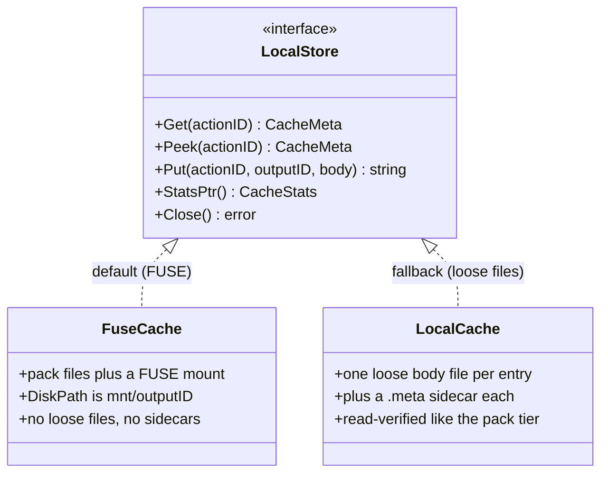
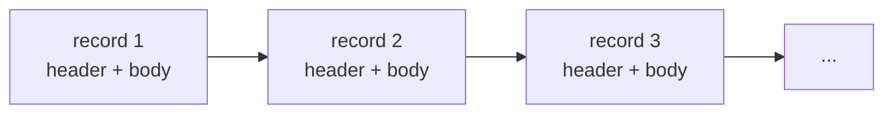
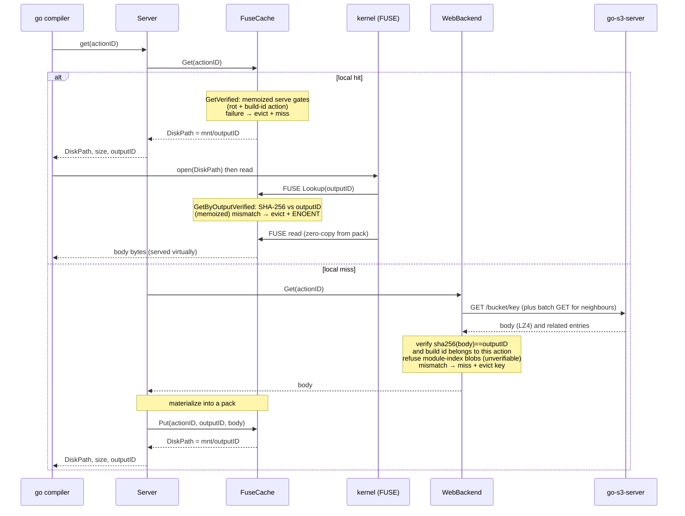
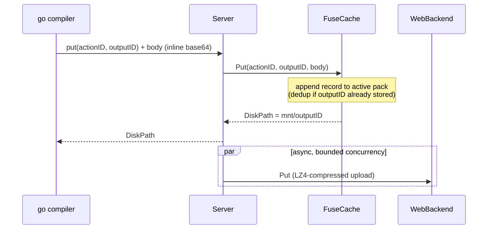
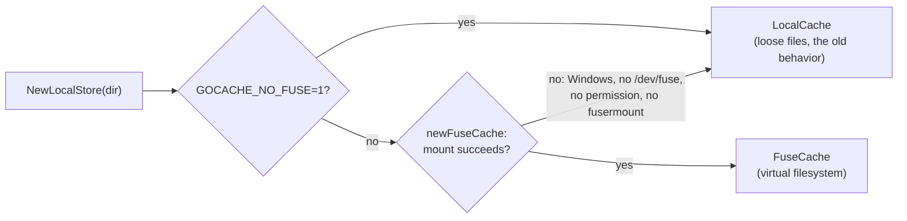

# The go-toolchain build cache

This document explains how go-toolchain caches Go build artifacts: the
GOCACHEPROG protocol, the two-tier (local + web) design, and — the interesting
part — how the local tier is a **FUSE virtual filesystem** that collapses the
build cache's notorious tiny-file explosion into a handful of pack files.

- [The problem: a build cache is mostly tiny files](#the-problem)
- [GOCACHEPROG in one paragraph](#gocacheprog)
- [The key insight: GET returns a *path*, not bytes](#the-key-insight)
- [Architecture](#architecture)
- [The local tier is a virtual filesystem](#the-local-tier-is-a-virtual-filesystem)
- [Pack file format](#pack-file-format)
- [Request flows (GET / PUT)](#request-flows)
- [Fallback and portability](#fallback-and-portability)
- [Where the bytes live](#where-the-bytes-live)

<a name="the-problem"></a>
## The problem: a build cache is mostly tiny files

Go's own build cache (`$GOCACHE`) stores **two files per cache entry**: an
action-index file (always the same fixed size, ~175 bytes) and an output/data
file (the actual artifact). On a real workspace the index files alone number in
the hundreds of thousands, and a large fraction of the *data* files — source
file lists, vet facts, export-data stubs — are well under 1 KiB.

Tiny files are expensive out of proportion to their bytes: each one burns an
inode, a directory entry, and (rounding up to the filesystem block size, usually
4 KiB) most of a block. A cache holding 170 KB of index data can occupy ~4 MB on
disk — a >20x amplification — before you count the data files.

go-toolchain replaces `$GOCACHE` entirely with a GOCACHEPROG server, so it owns
the storage policy and can fix this.

<a name="gocacheprog"></a>
## GOCACHEPROG in one paragraph

`GOCACHEPROG` is a Go toolchain hook (Go 1.24+): point it at a program and the
`go` command talks to that program over stdin/stdout with newline-delimited JSON
instead of managing `$GOCACHE` itself. The verbs are `get`, `put`, `close`. A
`put` ships the body inline (base64 on the line after the JSON). A `get` hit is
answered with metadata **and a `DiskPath`** — see below. go-toolchain implements
this protocol in [`src/cache`](../src/cache); `src/cmd/cacheprog.go` is the
entry point.

<a name="the-key-insight"></a>
## The key insight: GET returns a *path*, not bytes

The protocol is asymmetric, and the asymmetry is the whole design:

| Verb | How the body moves |
|------|--------------------|
| **PUT** | body travels **inline** over the protocol (base64 after the JSON request) |
| **GET** | response carries a **`DiskPath`**; the compiler/linker open and mmap that path **themselves** — the bytes never travel back over the protocol |

So a cache hit hands the compiler a *filesystem path*. And nothing requires that
path to be a normal file. If we back it with a **FUSE mount**, the cache program
*is* a virtual filesystem and the JSON protocol is just the coordination
channel. The body can live packed; the kernel materializes it virtually when the
compiler reads the path. That is exactly what the local tier does.

<a name="architecture"></a>
## Architecture

One `go-toolchain` invocation starts **one cache daemon**. Every `go`
subprocess it spawns (`go vet`, `go test`, `go build`, ...) is pointed at a thin
`cacheprog` that just proxies to the daemon over a Unix socket, so the web index
is loaded once and the local cache is shared.

```mermaid

flowchart TB
    subgraph go["go subprocesses (vet, test, build)"]
        g1["go 1 to gotoolchain cacheprog"]
        g2["go 2 to gotoolchain cacheprog"]
        g3["go 3 to gotoolchain cacheprog"]
    end

    g1 -- "JSON over stdio" --> P1[proxy]
    g2 -- "JSON over stdio" --> P2[proxy]
    g3 -- "JSON over stdio" --> P3[proxy]

    P1 & P2 & P3 -- "Unix socket" --> D{{"Cache Daemon<br/>(one per build)"}}

    D --> SRV["Server<br/>(per connection,<br/>shared backends)"]
    SRV --> L["LocalStore<br/>(FuseCache)"]
    SRV --> W["WebBackend<br/>(remote)"]

    L --> PS[("PackStore<br/>pack-*.data")]
    L -. "mount(2)" .-> M[/"FUSE mount<br/>buildcache/mnt"/]
    W -- "HTTPS: GET/PUT,<br/>/_index, /_batch/get" --> S3["go-s3-server<br/>(shared cache)"]

    M -. "kernel serves read()<br/>from PackStore" .-> g1

```

The two tiers:

- **Local tier — `FuseCache`** (`src/cache/fusecache.go`, `src/cache/pack.go`):
  process-local, backed by pack files and exposed via FUSE. First port of call
  for every `get`; every `put` is written here synchronously.
- **Remote tier — `WebBackend`** (`src/cache/web.go`): the shared
  [go-s3-server](https://github.com/wow-look-at-my/go-s3-server) (being renamed
  go-toolchain-cache). Consulted on a local miss; populated asynchronously on
  `put`. Fetch routing is driven by the server's key index, fetched once at
  startup (with a short dedicated budget): keys the index lists are fetched
  through the coalescing **batch GET** endpoint — one round-trip serves many
  concurrent requests and returns temporally-related prefetch entries (same
  build) that pre-populate the local pack — see
  [`src/cache/batch.go`](../src/cache/batch.go); keys an AUTHORITATIVE (fresh)
  index does not list miss cleanly with no round-trip, while a failed index
  fetch keeps cold-key batch probing enabled as the recovery path (bounded by
  the consecutive-empty-batch backoff). A key the server authoritatively
  reports absent despite an index claim is dropped from the client's key set
  so the next `put` re-uploads it. Uploads are coalesced symmetrically:
  buffered PUTs ship as one **batch PUT** tar (`/_batch/put`,
  `manifest.json` + `data/<key>` members — see
  [`src/cache/batchput.go`](../src/cache/batchput.go)) so a build's thousands
  of stores take one server admission slot per ~128 objects, with a sticky
  fallback to individual PUTs against a server without the endpoint. The wire
  protocol is **not
  S3**: object metadata travels in native `X-Cache-Meta-*` headers and errors
  are native plain text. The client still reads the deprecated `X-Amz-Meta-*`
  response header as a fallback so it interoperates with a not-yet-upgraded
  server during a rollout. Every PUT (batch manifest entry or single-PUT
  headers — both render the same map, assembled once in
  [`src/cache/webput.go`](../src/cache/webput.go)) carries **provenance
  metadata** alongside the protocol fields: `Pkg` (the archive's import
  path), `Src` (source-file basenames, capped at 8 names / 256 bytes with a
  `+N more` suffix so the value always fits the server's xattr budget),
  `Module` (the producing repo's main module path), `Go-Version`/`Target`,
  `Toolchain-Version`, and `Created`. The server stores them as xattrs and
  returns them on GET/HEAD, so `curl -I` on any stored key answers "what
  file/package/repo did this cache item come from?" — the full key list and
  an example live in the README's "How It Works" section.

<a name="the-local-tier-is-a-virtual-filesystem"></a>
## The local tier is a virtual filesystem

The local tier is defined by the [`LocalStore`](../src/cache/store.go)
interface, with two implementations: `FuseCache` (default) and `LocalCache`
(the loose-file fallback).



`FuseCache` is the default (when FUSE is available). It wraps a **`PackStore`**
— an append-only, content-addressed object store — and mounts a **read-only
FUSE filesystem** at `<cache>/buildcache/mnt`:

- **`Get(actionID)`** looks up the body's location in the in-memory index and
  returns `DiskPath = <mnt>/<outputID>`. No I/O on the body.
- The compiler opens that path. The kernel routes the `open`/`read` to the
  daemon's FUSE handler, which serves the bytes straight from the pack with a
  single `ReadAt` — supporting partial/random reads (mmap) with no copy of the
  whole body.
- **`Put`** appends the body to the active pack and returns the same
  `<mnt>/<outputID>` path.

The result: **no loose file and no metadata sidecar is ever written per entry.**
A build that would have produced ~1,000 tiny files produces **one pack file**.

> Measured on a real `go-s3-server` build: the entire local build cache was a
> single 73 MB `pack-000001.data` holding ~500 objects — `0` `.meta` sidecars
> and `0` loose body files — while the build hit the cache `~7000` times, all
> served through the mount.

<a name="pack-file-format"></a>
## Pack file format

A pack file is a flat sequence of self-describing records. The in-memory index
(`actionID → location` and `outputID → location`) is rebuilt purely by scanning
the packs at startup — there is no separate index file to corrupt or keep in
sync.

Each record is a fixed 88-byte header followed by the body:

| Field | Size | Meaning |
|-------|------|---------|
| `magic` | 4 B | `"GTPR"`; anything else ends the scan (garbage / torn write) |
| `actionID` | 32 B | cache key (SHA-256) |
| `outputID` | 32 B | content hash (SHA-256) — also the virtual filename |
| `created` | 8 B | unix seconds |
| `dataLen` | 8 B | body length |
| `crc32` | 4 B | IEEE CRC of the body, verified before the body is served |
| `body` | `dataLen` B | the cached object, stored uncompressed |

Records are simply concatenated:



Design properties:

- **Self-describing & crash-safe.** Startup reads only the fixed 88-byte headers
  (never the bodies), so the scan is cheap even for multi-GB packs. A torn final
  record (crash mid-append) declares a length running past EOF and is silently
  dropped — the store is crash-safe by construction.
- **Integrity-checked on read.** A torn-tail check cannot catch a body that is
  full-length but corrupt in content (overlay/disk bit-rot, a partial
  overwrite). So the body's CRC is verified against the header before it is
  served; a mismatch evicts the entry and reports a **miss**, so the toolchain
  recomputes rather than being handed a corrupt object. Serving corrupt bytes is
  never an option — e.g. a corrupt Go module index fails the build with `corrupt
  index` / `package ... is not in std`, which the `go` process cannot recover
  from. Crucially the check runs on **both** read paths, because they are
  decoupled by the protocol: a GET *RPC* returns a `DiskPath`, and the compiler
  then opens that path and reads the body itself through the mount — a read that
  never re-enters the GET RPC. So the body is verified (1) on the GET RPC, by
  `GetVerified` — a CRC over the body, which lets the server miss and recompute
  in-band; **and** (2) on the mount's serve path, by `GetByOutputVerified` when
  `Lookup` resolves `mnt/outputID` to an inode, which is the gate on the bytes the
  compiler actually consumes. The serve-path gate verifies the body's **SHA-256
  against the requested `outputID`** (the content address) rather than the CRC:
  this strictly subsumes the CRC — it catches rot *and* a torn or mis-mapped
  record whose bytes are self-consistent with their own recorded CRC yet are not
  the content the compiler asked for (which would otherwise surface as `corrupt
  index` / `package ... is not in std`, e.g. a poisoned module index when the
  shared web cache is unavailable). Verifying only the RPC would leave the
  compiler-facing read unguarded. Large bodies are verified over
  an **mmap** of the pack region (via
  [go-mmap](https://github.com/wow-look-at-my/go-mmap)) so a multi-MB archive is
  never copied onto the heap on every hit; tiny entries (the common case) take a
  plain read. The CRC is recorded at write time, so it vouches only for bytes
  that were correct when stored; a body that arrives *already* corrupt from the
  remote tier is caught earlier, at ingestion — see below.
- **Content-addressed dedup.** `outputID` is the SHA-256 of the body, so
  identical content put under different actions is stored once. The second and
  later actions append a tiny header-only **alias record** (a second magic,
  `dataLen 0`) that maps their `actionID` onto the already-stored `outputID`.
  The alias is written to disk on purpose: a build is full of duplicate content
  (every empty output — vet success, empty stdout — shares `sha256("")`), and if
  the dedup lived only in memory those thousands of mappings would vanish on
  restart and miss on the next build, falling through to the slow network tier.
- **Bounded growth.** Packs rotate at 1 GiB (`pack-000001.data`,
  `pack-000002.data`, ...). If the total exceeds the budget at startup, whole
  packs are evicted **oldest-first** down to ~80% of the budget
  (`src/cache/packevict.go`); the newest pack — the append target holding the
  hottest records — is never evicted. Evicted records are simply recomputed;
  the hot tail of the cache survives instead of cold-cycling.
- **Verified-read memoization.** The serve gates below consume per-record
  facts (CRC-ok, SHA-256 vs `outputID`, package shape, build-id stamp)
  computed by ONE body read and memoized by
  `(packID, dataOff)` (`src/cache/verify.go`) — sound because records are
  append-only and physically immutable within a process. Just-appended records
  are pre-memoized from the in-memory bytes, so the compiler's open right
  after a PUT costs no re-read + hash. Facts are memoized, verdicts are
  per-call: the per-action build-id gate is still applied on every `get`.

<a name="request-flows"></a>
## Request flows

### GET



**Integrity at the network boundary.** The remote tier is shared (one S3 cache
serves every machine), so a single corrupt object — a truncated upload, a bad
LZ4 round-trip, or bit-rot at rest — would otherwise poison every consumer and
stick across runs: stored into a pack with a self-consistent CRC, it would pass
`GetVerified` on every later hit and be served as "valid" forever, surfacing in
the `go` command as an unrecoverable `corrupt index`. The pack CRC cannot stop
this because it is computed *from the bytes handed to `Put`* — including ones
that were already corrupt on arrival. So every body ingested from the web tier
is verified **end to end** before it is materialized: it must hash (SHA-256) to
its advertised `outputID`, which is exactly the content hash the `go` command
computed (and which the pack store's content-addressed dedup already trusts). A
mismatch is refused — treated as a miss, never stored or served — and the
poisoned key is dropped from the in-memory remote index, so the toolchain
recomputes the object and the next `Put` re-uploads it clean instead of skipping
as already-present. This covers all three ingestion paths: the individual GET,
the batch GET, and the prefetch population of neighbours. The check is counted
as `checksum` in the daemon's `web summary` miss breakdown.

**Integrity vs. the right key, not just the right bytes.** The outputID hash
proves a body is internally consistent with its content id — but *not* that the
content belongs under the **action** the cacheprog was asked for. A
self-consistent object mapped to the wrong action key passes every hash check
and still poisons the build: the canonical case is `internal/reflectlite` export
data served for the `runtime` action, which the Go loader reports as the
baffling `"runtime" imported as reflectlite`. Neither the CRC nor the outputID
hash can catch this — the bytes are a perfectly valid object, just the wrong
one. A compiled package, though, self-certifies which action produced it: the Go
toolchain stamps `build id "ACTION/CONTENT"` into the archive's `__.PKGDEF`
header, where `ACTION` is `base64.RawURLEncoding(actionID[:15])` — the very hash
that is the cache key. So `buildIDMatchesAction`
([`src/cache/buildid.go`](../src/cache/buildid.go)) parses that field and rejects
any object whose build id belongs to a different action than requested, treating
it as a miss and evicting the key so a recompute re-uploads the correct object.
The guard runs on every remote ingestion path (individual GET, batch GET,
prefetch population) **and** on the remote PUT, so a mis-keyed object can neither
be served from the shared cache nor written to it. It is counted as `buildid` in
the `web summary` miss breakdown.

The check also refuses a **package archive that carries no build id at all**:
`go build`/`vet`/`test` always stamp one, so an object that presents as a
loadable package (an ar archive with a `__.PKGDEF` member) yet lacks a build id
is corrupt — or has been deliberately *stripped* to slip a different package's
export data under this key while evading the comparison above. Plain non-archive
entries (vet facts, command stdout, source-file lists, empty outputs) have no
`__.PKGDEF` and legitimately carry no build id, so they fall through to the
outputID hash as before; only objects shaped like a package are required to
prove their key. This is best-effort *integrity*, not an *authorization*
boundary: a writer who forges a build id matching the target action still
passes, because the cache trusts whoever can write to it. A shared cache must
therefore also control who may `PUT` (and treat the store as untrusted-write) —
the build-id guard stops accidental cross-contamination and unsophisticated
tampering, not a credentialed attacker. The poisoned key self-heals: under the cache
server's default `write_once: allow`, the recompute's re-`Put` overwrites the
bad object; an operator can also evict it directly via the cache server's
`DELETE` endpoint.

**The one payload that cannot be key-verified: the Go module index.** `cmd/go`
stores its package/directory index *through* the build cache too —
`cache.Default()` is the GOCACHEPROG when one is set, so the index's
`PutBytes`/`GetMmap` flow over this protocol just like compiled objects. But an
index blob is the worst of both worlds for the guards above: it carries **no
build id** (so `buildIDMatchesAction` waves it through, exactly like vet facts),
and it does **not** embed the directory it indexes in any form checkable against
the requested `dirHash` action key — yet a wrong one is *silently fatal at
package load*. An index for a directory with no Go files served for
`$GOROOT/src/runtime` makes the loader report `package runtime is not in std`
and fail before compilation starts; a truncated or cross-version one yields
`corrupt index`. The outputID hash only proves the blob is self-consistent, not
that it belongs under this key, so a mis-keyed-but-well-formed index slips every
check. The MODULE-level key is weaker still: `moduleHash` hashes
`runtime.Version()`, the index format version and the modroot — **no content at
all** — so nothing anywhere can tell a right body from a wrong one under it, and
a wrong one hands the loader one module's index for another's. That surfaces as
packages arriving under the wrong `Name`: `go list` reports the name, and
`go/packages` copies it verbatim into `types.NewPackage(PkgPath, Name)` without
ever correcting it from export data, so an unrelated package reaches the
type-checker literally named `trace` and every symbol in it is `undefined:`.

Because an index is cheap for `cmd/go` to recompute locally (one directory
read), the answer is to trust one from no tier at all:
`isGoModuleIndex` ([`src/cache/modindex.go`](../src/cache/modindex.go)) detects
the `go index v` magic, and the cacheprog **refuses every module-index blob** —
on shared-tier ingestion (individual GET, batch GET, prefetch population), on
the shared-tier upload, on the local **PUT** (`handlePut`, so nothing enters the
store), and on the local serve path (`verifyBodyForServe` and the pack tier's
`servableForAction`, so residue an older binary left behind cannot be handed
back either). Refused shared-tier GETs are counted as `modindex` in the `web
summary` miss breakdown; refused local PUTs are counted by
`Server.IndexPutsRefused`. A false positive (some other payload starting with
the same magic) costs only a recompute, never correctness, so the prefix match
is deliberately conservative. On the shared tier this is also a *client-side*
defense: the cache server stores opaque bytes and cannot itself tell a good
index from a poisoned one, so enforcement lives where the semantics are known.

Refusing at the local PUT is what makes refusing at the local serve path safe.
The serve-path refusal **alone** is a permanent accept-at-Put/refuse-at-Get
loop: `cmd/go` stores hundreds of per-directory index blobs per invocation and
re-stores every one it recomputes, so every index key would miss on every build
forever — per-key eviction log spam on the loose tier, duplicate-record append
churn and unbounded pack growth on the pack tier. With the PUT refused there is
nothing to re-offer and nothing to append.

A refused PUT is **not an error**. `cmd/go` treats a failed index store as fatal
(`openIndexModule` returns it), and the GOCACHEPROG contract still requires the
"put" reply to name a file holding the body until "close" — an empty `DiskPath`
is rejected outright with `GOCACHEPROG didn't return DiskPath in put response`.
So the body is written to a scratch sink outside the cache
(`Server.sinkIndexBody`: a private temp dir, content-addressed by `outputID`,
removed when the protocol loop ends). Nothing enters the cache, no key is ever
looked up in the sink, and the next GET for that key misses — which is exactly
what makes `cmd/go` recompute. Measured cost of running without it, over seven
cold-cache runs of this repo's own pipeline each way: none that separates from
the noise (vet's package load took 42–49s with the index refused against 39–59s
with it stored, in a phase dominated by compiling dependencies from scratch),
and the sink peaked at 3.2 MB over 280 blobs.

### PUT



Note the bodies are stored **uncompressed** in the pack (the web tier compresses
for transport only). Uncompressed storage is what lets FUSE serve a `read()` at
an arbitrary offset with a single `ReadAt` — essential for the compiler's mmap'd
random access, which a compressed stream could not satisfy without decompressing
the whole object on every read.

Two ordering guarantees protect the PUT path against racing writers for the
same action key:

- **Append order == index order.** `PackStore.Put` commits its in-memory index
  update *under the append lock*, so the record order in the pack file always
  matches the order the live index applied. Before this, two racing Puts for
  the same action with different contents could commit their map updates in
  the opposite order of their file appends — the live daemon served one body
  while the **next** process's startup scan ("last write wins" over file
  order) served the other, a silent cross-build divergence that surfaced as an
  unrecoverable `corrupt index` on the following build.
- **Local wins over web.** The prefetch population stores through
  `PutIfAbsent`, whose absence check runs under the same append lock as the
  write: a web-originated body can never displace a locally-computed entry,
  no matter how the race resolves. Symmetrically, the PUT RPC's dedup check
  now compares the stored entry's `outputID` with the incoming PUT's and
  **overwrites on mismatch** — `cmd/go` is the source of truth for its own
  action keys, so a mis-keyed body that somehow got in self-heals on the next
  PUT instead of being sticky while the fresh correct body was discarded.

## Remote-cache resilience (fail-safe under outages)

The remote (web) tier is best-effort. A backend problem — 5xx, timeout,
connection reset, or an empty/corrupt response — must **never** stall or corrupt
a build; it can only ever cost a slower build-from-source. Two independent
invariants enforce this:

1. **Integrity** (covered above): a body that fails its `outputID` hash, build-id
   action, or pack CRC — or that is an unverifiable Go module index — is treated
   as a miss, never served. A backend can hand us garbage and the worst outcome
   is a recompute.
2. **Failure handling** (`web_resilience.go`): the cache layer degrades cleanly
   and *fast*, and never amplifies an outage.

   - **GET** on any non-200 / timeout / network error returns a clean miss. The
     toolchain recompiles from source.
   - **PUT** is fire-and-forget: a failure (after the bounded retry below) is
     dropped silently for that one object — a missed upload only costs a future
     cache miss, never build correctness.
   - **Bounded retries** with exponential backoff + full jitter cover transient
     blips (a single 5xx/429 among many 200s), so an isolated hiccup becomes a
     hit rather than a wasteful recompute. Retries honor the server's
     `Retry-After` header (the admission-control 503 shed's "wait," not "give
     up") as a floor on the backoff, and apply to GETs, the batch GET, and PUTs
     (single and whole-batch tar — the key is a content address so re-storing is
     a no-op). This is the **only** backpressure handling: there is no circuit
     breaker. A remote GET/PUT is *always* attempted; a failure that outlasts the
     retry budget falls back to a local miss for that single operation and the
     remote tier is never disabled for the rest of the run. (An earlier circuit
     breaker was removed: once PUTs are batched into one `/_batch/put` request per
     ~128 objects holding one server admission slot, the server does not collapse
     under CI load, and the breaker's failure mode — a transient 503 tripping it
     and disabling *GETs* too, i.e. "no cache hits at all" — was pure downside.)

   Tunable via `GO_TOOLCHAIN_CACHE_MAX_RETRIES` (transient retries; `0` disables).

3. **Uniform serve-path integrity — self-healing local tier**
   (`src/cache/verify.go`): the rot and build-id checks the web tier runs on
   ingestion also run on the **local** serve path, so the cache never serves an
   object it cannot tie to the requested key — on either tier. The GET-RPC gate
   behind every FUSE hit (`PackStore.GetVerified`) verifies, from the memoized
   facts of one body read, that the object (a) is rot-free (its recorded CRC,
   or the strictly stronger SHA-256 content address) and (b) carries a build id
   whose action field matches the requested key — not a cross-contaminated
   package mapped under the wrong key, the `"runtime" imported as reflectlite`
   poison. Any failure evicts the entry and reports a miss, so the toolchain
   recomputes from source and re-Puts clean data. Module-index refusal is NOT a
   local serve gate: it lives on every web ingestion path (individual GET,
   batch GET, prefetch) plus the upload path, which is exactly what makes a
   local index locally-originated and therefore servable (upstream-`GOCACHE`
   parity; see above). The residual gap — local data written by binaries older
   than those ingestion guards — is closed by the one-time local cache version
   purge (`src/cache/cacheversion.go`), not per-Get inspection. So a poisoned
   local cache **self-heals structurally** — by refusing to serve what it
   cannot verify, never by inspecting build output. (Fixing the *shared* cache
   so other consumers stop hitting a poison is still the server's job — its
   module-index refusal and cache-version purge.)

<a name="fallback-and-portability"></a>
<a name="fork-toolchain-key-namespacing"></a>
## Fork-toolchain key namespacing

Builds done with the gosmopolitan fork toolchain (matrix `cosmo` and wasm
targets) get their cache keys **namespaced by a content hash of the toolchain
in use**. The fork stamps a constant release version (`go1.26.4cosmo`) into
every build, so cmd/go's release rule derives identical tool build IDs for
*different* fork toolchain builds; identical tool IDs collide on action IDs,
and a shared cache then serves objects compiled by one toolchain build into
links done by another. Every per-entry integrity gate passes by construction —
each colliding entry is self-consistent, just compiled by a different
compiler — and the result is SIGSEGV binaries (the 2026-07-20 incident).

Mechanics, end to end:

1. **Fingerprint** — before any fork job builds, the matrix path hashes the
   toolchain's tool binaries (`VERSION`, `bin/`, `pkg/tool/` — SHA-256 over
   path+size-framed contents, 16 hex chars; `forkToolchainCacheNamespace` in
   `src/cmd`). If any tool's bytes differ the namespace differs; if every tool
   is byte-identical the toolchains are interchangeable and sharing is safe.
   Fingerprint failure fails the build — never a silent un-namespaced run.
2. **Propagate** — each fork build job exports it as
   `GO_TOOLCHAIN_CACHE_NAMESPACE` (`cache.KeyNamespaceEnv`); the fork `go`
   process passes it down to the cacheprog subprocess it spawns. `runBuild`
   refuses a fork job without a namespace (last-chokepoint guard).
3. **Isolate** — a namespaced cacheprog never proxies to the shared daemon
   (the proxy is a raw byte pipe; the daemon serves unnamespaced clients). It
   runs the standalone server — own web backend + loose local tier, the same
   arrangement as any daemonless cacheprog.
4. **Transform** — the server derives every store key as
   `hex(ActionID) + namespace` (`Server.actionKey`, the single choke point
   where a protocol ActionID becomes a store key). Local get/peek/put, remote
   get/put, batch GETs, prefetch population, web-index membership, and stale-
   claim bookkeeping all consume that derived key, so no path bypasses the
   namespace on either tier.

The namespace is a **suffix**, deliberately: `expectedBuildIDAction` derives
the build-id expectation from the first 15 bytes of the hex-decoded key, and a
suffix leaves those bytes intact — so the build-id action guard keeps
verifying compiled packages against the *real* cmd/go action ID. (A
hash-combined rewrite would break that guard.) Unnamespaced keys are exactly
64 hex chars and namespaced ones strictly longer, so the two populations can
never collide; `outputID`s are content addresses and stay untouched. Stat
events keep the raw ActionID, so per-action build profiles still join cmd/go's
actiongraph dumps. Normal (non-fork) builds set no namespace and their keys
are byte-identical to before.

## Fallback and portability

The cache is an optimization, never a correctness dependency, so FUSE failure
degrades gracefully:



- **Mounting** uses go-fuse's `DirectMount`: the `mount(2)` syscall (works as
  **root**, e.g. in containers) with an automatic fallback to the `fusermount`
  helper (works for **non-root CI runners**). One setting covers both.
- **Escape hatch**: setting `GOCACHE_NO_FUSE=1` forces the loose-file
  `LocalCache` and skips FUSE entirely — a way to sidestep the FUSE tier
  wholesale if a mount misbehaves in some environment, without a code change.
- **Windows / no FUSE**: `newFuseCache` returns `errFuseUnsupported` and
  `NewLocalStore` falls back to the loose-file `LocalCache`.
- **Single owner**: only the daemon (one process per build) owns the mount, so
  concurrent standalone `cacheprog` invocations can't collide on one mount
  point; standalone mode uses the loose cache.
- **Crash recovery**: a stale mount left by a crashed daemon is lazily unmounted
  before a fresh mount; the pack store is rebuilt by scanning.

<a name="where-the-bytes-live"></a>
## Where the bytes live

```
<XDG_CACHE_HOME>/go-toolchain/buildcache/
├── .cache_version           # local cache version stamp (see below)
├── mnt/                     # FUSE mount point (empty when unmounted)
│   └── <outputID>           # virtual files; reads served from packs
└── packs/
    ├── pack-000001.data     # append-only records (see format above)
    └── pack-000002.data     # ... after rotation at 1 GiB
```

Compare the loose-file fallback, which writes `buildcache/<aa>/v1<actionID>` plus
a `.meta` sidecar **per entry** across 256 shard directories — the layout this
design replaces.

**Local cache versioning.** The buildcache root carries a `.cache_version`
stamp (`src/cache/cacheversion.go`); a root without one is implicitly version
1. When the stamp differs from `currentLocalCacheVersion`, the cached DATA —
the `packs/` dir, the loose tier's `00`..`ff` bucket dirs, stray temp files —
is deleted once and the stamp rewritten (atomically, temp + rename), before the
FUSE mount and before either tier opens, in every mode (daemon, standalone
`cacheprog`, `GOCACHE_NO_FUSE=1`). `mnt/` (a possibly-mounted mountpoint), the
`.fuse.lock` file, and unknown names are never touched, and the purge briefly
takes the same exclusive flock the FUSE daemon holds, so it can never delete
packs out from under a live owner (when the lock is busy the purge is deferred
to the next run). Bump the constant to force every machine to shed cache
contents a code change has made untrustworthy — the client-side mirror of
go-s3-server's `currentCacheVersion`. Module-index residue does **not** need a
bump: the serve-path refusal evicts an index as it is read, so a warm root sheds
its own without discarding the compiled objects around it.


## From CLAUDE.md: the src/cache package

Extracted verbatim from CLAUDE.md, where this was a single 15,978-character bullet —
the largest item in a file 1.85x over its 40,000-character budget.

- `src/cache/` — GOCACHEPROG protocol server with local and web backends, server-side batch GET with prefetch. **Key namespacing** (`namespace.go`): `GO_TOOLCHAIN_CACHE_NAMESPACE` (`KeyNamespaceEnv`, set by matrix fork-toolchain jobs — see the matrix section above) scopes every action key of a cacheprog process: `Server.actionKey` — the ONE choke point where a protocol ActionID becomes a store key (handleGet/handlePut) — derives `hex(ActionID) + namespace`, so local get/peek/put, remote get/put, batch, prefetch population, index membership, and ForgetStale all see only namespaced keys and no path can bypass the isolation. The namespace is a SUFFIX on purpose: `expectedBuildIDAction` reads the first 15 bytes of the hex-decoded key, which a suffix preserves, so the build-id guard keeps verifying against the real cmd/go action ID (a hashed rewrite would refuse every namespaced compiled package); suffixed keys (>64 hex) can never collide with unnamespaced ones (exactly 64). A namespaced cacheprog NEVER proxies to the daemon (`daemonSockUnlessNamespaced` in cacheprog.go — the proxy is a raw byte pipe and the daemon serves unnamespaced clients); it runs the standalone server with `SetKeyNamespace` (canonicalized via `CanonicalKeyNamespace`: lowercase-hex even-length 2..64 pass-through, anything else hashed to 16 hex — even length keeps the build-id guard's hex decode intact). Stat events keep the RAW ActionID so build profiles still join actiongraph dumps. The protocol read loop lives in `readloop.go`: request lines and the PUT base64 body line are read with an UNCAPPED line reader (the old `bufio.Scanner` had a 64 MiB token cap that killed the loop on PUT bodies ≥ ~48 MiB raw — after committing an empty body under the request's real IDs); the body decode is strict (quoted — what go ≤ 1.25 actually writes — or raw base64; decoded length must equal `BodySize`), and a malformed body line fails only that PUT with an `Err` reply, storing nothing, while the loop keeps serving. The local tier (`LocalStore` interface, now including `Peek` — `Get` without counting a hit, used by the PUT dedup check so warm rebuilds don't inflate the hit rate — and `PutIfAbsent`, the atomic check-and-store the prefetch population MUST use so a web-originated body can never displace a locally-computed entry; the PUT dedup itself only short-circuits when the stored outputID matches the incoming PUT's, and OVERWRITES on mismatch — cmd/go is the source of truth for its own action keys. `PackStore.Put` commits its index updates UNDER the append lock, so pack-file record order always equals live-index order and a startup rescan can never resurrect a different winner than the live daemon served — the cross-build "corrupt index" divergence fixed after CI run 29410024636, regression-pinned by `packorder_test.go`) is a FUSE virtual filesystem (`fusecache.go` + `pack.go`): bodies are stored in append-only pack files and served on demand through a read-only mount, eliminating the per-entry tiny files. `local.go` is the loose-file fallback used when FUSE is unavailable (Windows, missing /dev/fuse, `GOCACHE_NO_FUSE=1`, nested runs, standalone cacheprog); it enforces the same read-side gates as the pack tier via `verify.go`'s `verifyBodyForServe` — sha256(body)==outputID and build-id action — evicting data+sidecar and missing on failure, with a per-process memo so the dedup `Peek` and warm re-Gets don't re-read+re-hash. Every cached body is integrity-checked on read: a bad body is evicted and reported as a cache miss rather than served, so the toolchain never consumes a damaged object (e.g. a corrupt module index → `corrupt index` / `package ... is not in std` build failure). The check runs on **both** decoupled read paths — `PackStore.GetVerified` on the GET RPC, **and** `PackStore.GetByOutputVerified` on the FUSE serve path (`fuseRoot.Lookup`), the gate on the bytes the compiler actually reads through the mount (a GET returns a `DiskPath` that the compiler opens itself, never re-entering the RPC). Both consume **memoized verification facts** (`verify.go`): one body read (or the in-memory bytes at Put time) computes CRC-ok, sha256-vs-outputID, package-archive shape, and build-id stamp action, keyed by `(packID, dataOff)` — sound because pack records are physically immutable within a process (append-only; truncate only at startup pre-serving; eviction only drops index entries). Facts are memoized, VERDICTS are per-call: the GET RPC requires rot-free + build-id-action-matches-THIS-key (so an aliased archive stamped for another action is refused even on a memo hit), while the FUSE serve path requires the body's **SHA-256 against the requested `outputID`** (the content address; `outputID == sha256(body)` is the GOCACHEPROG invariant), which strictly subsumes the CRC — it also catches a torn or mis-mapped record self-consistent with its own recorded CRC. Rot detection is therefore a cross-RUN property (a fresh process re-verifies; the residual post-verify window matches what the kernel page cache + FOPEN_KEEP_CACHE already accept). Pack growth is bounded by **oldest-first whole-pack eviction** at startup (`packevict.go`: over `packResetBytes` → delete lowest-id packs down to ~80% of budget; the newest pack is never evicted), replacing the old wholesale reset that cold-cycled any working set ≥ the budget. Set `GOCACHE_NO_FUSE=1` to force the loose-file cache and skip FUSE entirely. Bodies arriving from the shared web cache tier are additionally verified **end to end** at ingestion (`integrity.go`'s `outputIDMatches`): a body must hash (SHA-256) to its advertised `outputID` or it is refused as a miss and never materialized — covering all three web→local paths (`getIndividual`, `sendBatch`, prefetch in `wireBatchCallbacks`) and stopping a single poisoned remote object from sticking across runs. A second, orthogonal guard (`buildid.go`'s `buildIDMatchesAction`) catches cross-contamination the hash cannot — a *self-consistent* object mapped to the **wrong action key** (e.g. `internal/reflectlite` export data served for the `runtime` action → `"runtime" imported as reflectlite`): a compiled package stamps its action key into its `build id "ACTION/CONTENT"` header (`ACTION = base64.RawURLEncoding(actionID[:15])`), so an object whose build id belongs to a different action than requested is refused as a miss and its key evicted, on every remote ingestion path, the remote PUT, **and** the local serve path (`GetVerified`, so a poison already in the local pack is refused too — poison is neither served nor written from either tier); it **also** refuses a package archive (an ar archive with a `__.PKGDEF` member) that carries **no** build id at all — `go build`/`vet`/`test` always stamp one, so a build-id-less compiled object is corrupt or has been stripped to slip a different package's export data under this key (`archiveExportInfo` distinguishes a package archive from plain non-archive entries like vet facts/stdout, which still pass through to the hash gate). A third guard (`modindex.go`'s `isGoModuleIndex`) closes the one payload neither hash nor build-id can vet: the **Go module index**, which `cmd/go` also stores through the cacheprog (`cache.Default()` is the GOCACHEPROG) but which carries no build id and does not bind to its `dirHash` key, so a mis-keyed-but-well-formed one is served silently and breaks package load (`package runtime is not in std`, or `corrupt index`). The module-level key is weaker still — `moduleHash` hashes only the Go version, the index format version and the modroot, no content — and a wrong body under it hands the loader another module's index, which surfaces as a package reaching the type-checker under the wrong `Name` and a wall of `undefined:`. Index blobs (`go index v` magic) are cheap to recompute locally, so the cacheprog **refuses every module-index blob, in every tier and both directions**: shared-tier ingestion (individual GET, batch GET, prefetch) and upload, the local **PUT** (`handlePut` — nothing enters the store; counted by `Server.IndexPutsRefused`), and the local serve path (`verifyBodyForServe`, `servableForAction` — so residue an older binary left cannot be handed back). Refusing at the PUT is what makes the serve-path refusal safe: alone it would be a permanent accept-at-Put/refuse-at-Get miss loop, since cmd/go re-stores every index it recomputes (per-key eviction log spam on the loose tier, duplicate-record append churn on the packs). A refused PUT is not an error — cmd/go treats a failed index store as fatal and requires a non-empty `DiskPath` — so the body goes to a scratch sink outside the cache (`Server.sinkIndexBody`, removed when the protocol loop ends) and the reply names that file. Shared-tier refusals are counted as `modindex` in the `web summary`; there the refusal is also a client-side defense, since the cache server stores opaque bytes and can't distinguish a good index from a poisoned one. Separately, the **one-time local cache version purge** (`cacheversion.go`): a `.cache_version` stamp in the buildcache root, checked before either tier opens in every mode (daemon via `NewLocalStore`, standalone via `runCacheProg`) under the `.fuse.lock` flock so a live owner is never purged; a stamp != `currentLocalCacheVersion` (now 2) deletes only the known data children (`packs/`, the `00`..`ff` loose buckets, stray temps — never `mnt/`, the lock file, or unknown names) and re-stamps atomically. **Remote fetch routing / upload policy** (`web.go`, `webget.go`, `webput.go`, `batch.go`, `batchput.go`): keys listed by the startup index are fetched through the coalescing `/_batch/get` endpoint — sent as a **POST** (the server accepts GET too for older clients; a body-carrying GET is proxy-hostile) — one round-trip for up to 128 concurrent callers, with server prefetch; individual-GET fallback when the server lacks the endpoint (404/405), while keys ABSENT from an **authoritative** index (fresh 200/304 this run) miss cleanly with no round-trip (`skipped-not-in-index` / `skipped-empty-index` in the web summary). A FAILED index fetch leaves the key set non-authoritative, so cold keys are batch-probed (the recovery path for a client that doesn't know what the server holds), bounded by the consecutive-empty-batch backoff — this routing is what lets prefetch actually function (previously only index-absent keys were batched, so every batch was empty by construction and the backoff disabled batching ~1s into every cold run). `knownMiss` is set ONLY by an authoritative in-protocol absence (a 200 batch response lacking the key, or an individual 404), never by transient failures (network error/5xx), so a blip cannot freeze keys for the rest of the run. An authoritative absence for an index-claimed key drops the stale claim (`reclaimAbsent`, counted `reclaimed-404`) so the next PUT re-uploads the object instead of skipping it as already-present. PUT non-upload outcomes are counted and printed in the daemon web summary (`put-skipped: known/modindex/buildid`); the modindex counter reads 0 in normal operation now that `handlePut` refuses an index before either tier sees it — it is the boundary guard behind that one, and a nonzero value means a gap in the local refusal. PUTs are COALESCED client-side (`batchput.go`): `Put` preps each object synchronously (optimistic index claim, build-id/module-index guards, lz4, metadata map — one map is the single source of truth for BOTH the batch manifest and the single-PUT `X-Cache-Meta-*` headers, and carries provenance: `pkg`, `src` capped by `capSrcList` at 8 basenames / 256 bytes with a `+N more` suffix so it can't blow the server's ~4 KiB xattr budget, `module` from `WebConfig.Module` = the repo's main module path, plus `go-version`/`target`/`toolchain-version`/`created`) and enqueues it on the PUT coalescer, which ships up to ~128 objects as one `/_batch/put` tar (`manifest.json` + `data/<key>` members) — one server admission slot per batch instead of a per-object PUT storm; per-object server errors roll back only that object's claim, a 404/405 sets a sticky fallback to individual PUTs (each via `doRetryPUT`), and `Close` drains the PUT coalescer before the GET coalescer so daemon teardown never drops buffered uploads. There is NO client circuit breaker (removed with PUT batching): remote GETs/PUTs are always attempted, and the only backpressure handling is the shared bounded-retry loop (`web_resilience.go`'s `doRetry`) — transient statuses (5xx/429, incl. the admission-control 503 shed) are retried with full-jitter exponential backoff whose floor honors the server's `Retry-After`, and a failure that outlasts the budget is a per-operation local miss, never a disabled tier. The startup index fetch is bounded by **PROGRESS, not total elapsed time** (`web_index.go`), so a slow server still cannot stall daemon start for ~94s while a big-but-healthy index is no longer thrown away: `indexHeaderBudget` (10s) bounds the wait for response headers across the ≤ 1 retry (`doRetryGETN`), `indexStallTimeout` (10s) bounds the gap between successive body chunks (enforced by `stallGuardedReader`, which re-arms the shared `time.AfterFunc` watchdog before every read; firing cancels the request ctx and `wrapErr` labels the error as no-progress), and `indexFetchCeiling` (60s) caps the whole load regardless. This replaced a single 5s deadline over the entire load, which did not survive scale: the blob is 32 bytes per advertised key, so the org's ~900k-key cache serves ~29 MB, and a deadline sized for a small index cannot tell "server hung" from "big index streaming fine". The fallout of losing that race was not cosmetic — non-authoritative key set → index routing disabled → cold-key batch probes → empty-batch backoff → a run with `hits=0`, plus the three `logger.Warn`s that degradation path emits (index fetch, non-authoritative fallback, batch backoff), which count against the warnings budget and pushed a consumer over it (webhook-runner, 2026-07-25). Regression-pinned by `web_index_progress_test.go` (a steady-but-slow body whose total transfer far exceeds the stall window must still yield an AUTHORITATIVE index; a body that goes silent must still be abandoned on the stall window) — verified discriminating by mutation (removing the watchdog re-arm makes it red). Stats delivery to the parent uses an **accept-ack handshake** (dialers keep the stats connection only after reading the listener's ack byte, written after the connection is registered in the listener's WaitGroup), making `StatsListener.Close`'s drain deterministic (`src/cache/main_test.go`'s `TestMain` unsets `GOCACHE_STATS_SOCK` so unit tests never dial an ENCLOSING go-toolchain build's stats listener — that polluted its counters and, under a pre-handshake outer binary that never acks, stalled every `NewServer` in a test for the full 5s ack deadline). The `StatsListener` lives in `statslisten.go` and, beyond the counters, aggregates **per-action outcome events** for the build profile: `handleGet`/`handlePut` piggyback `Action` (20-char `truncateActionID` form — identical to the actiongraph `ActionID`), `Op` (`get`/`put`), `Outcome` (`hit-local`/`hit-remote`/`miss`/`put`), `Bytes`, and `DurUS` fields onto the StatEvents they already send (`withAction`; both directions of the wire format tolerate the fields being absent), and the listener folds them into a bounded map (`maxTrackedActions` 200k + overflow counter; first get outcome wins, put is sticky) exposed via `Actions()`/`ActionsOverflow()` — consumed by `src/profile`. Dedup re-puts emit no action event, so `put` means "output computed and stored this run". `websummary.go`'s `WebSummary` snapshots every web-tier diagnostic counter plus the startup index state (`IndexKeys`/`IndexAuthoritative`); `Daemon.Close` prints its summary line from the same snapshot, and `Daemon.WebSummary()` hands it to the profile (final after Close). In daemon mode the shared WebBackend's `Latency` sink and cumulative HTTP-pool snapshot are wired/reported exactly once by the Daemon — never per connection (that was a data race plus an N-fold pool overcount). The pack store's one mmap call site is behind a build-tag seam: `pack_mmap.go` (`!cosmo`) maps via wow-look-at-my/go-mmap exactly as before, `pack_mmap_cosmo.go` preads the span into a heap buffer (go-mmap has no cosmo port; fine, because the FUSE cache is compiled out under cosmo so PackStore is off the hot serve path there). See `docs/CACHE.md` for the full architecture and diagrams
